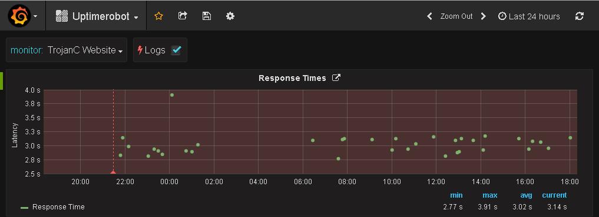

# node-influx-uptimerobot
A tool to get statistics from [Uptime Robot](https://uptimerobot.com/) and log it into [InfluxDB](https://www.influxdata.com/time-series-platform/influxdb/)

## Prerequisites
- NodeJS 5+
- [Uptime Robot](https://uptimerobot.com/) account
- [InfluxDB](https://www.influxdata.com/time-series-platform/influxdb/) instance

## Installation (NodeJS)
```bash
git clone https://github.com/trojanc/node-influx-uptimerobot.git
cd node-influx-uptimerobot
npm install
node index.js
```
Remember to create a configuration file, or have environment variables in place for your configuration.

## Installation (Docker)
```bash
git clone https://github.com/trojanc/node-influx-uptimerobot.git
cd node-influx-uptimerobot
docker build -t trojanc/node-influx-uptimerobot:v0.0.1 .
docker run --name node-influx-uptimerobot trojanc/node-influx-uptimerobot:v0.0.1
```
To really make it run you'll either have to pass in a number of environment variables (`-e`) with your configuration
 or map a config file via a docker volume (e.g. `-v ${PWD}/config.json:/usr/src/node-influx-uptimerobot/config.json`)

## Installation (Docker Compose)
```bash
git clone https://github.com/trojanc/node-influx-uptimerobot.git
cd node-influx-uptimerobot
docker-compose up
```
Make sure to edit the `docker-compose.yml` file and set your configuration.

## Application configuration
Place config in `config.json` or pass a parameter with the location of the config
file to use.

```json
{
  "application" : {
    "interval" : 10
  },
  "uptimerobot" : {
    "api_key" : "uxxxxxx-xxxxxxxxxxxxxxxxxxxxxxxx",
    "logs_limit" : 100,
    "response_times_limit" : 100
  },
  "influx" : {
    "host" : "localhost",
    "port" : 8086,
    "protocol" : "http",
    "username" : "admin",
    "password" : "admin",
    "database" : "uptimerobot"
  }
}
```
- **application.interval** Interval (seconds) at which to pull data. If not specified it will only do a pull once.
- **uptimerobot.api_key** Your Uptime Robot API key.
- **uptimerobot.logs_limit** Limit the number of logs to pull at a time.
- **uptimerobot.response_times_limit** Limit the number of responses to pull at time.
- **influx.host** Hostname or IP of your InfluxDB server.
- **influx.port** Hostname or IP of your InfluxDB server.
- **influx.protocol** protocol for your InfluxDB server.
- **influx.username** Username for your InfluxDB server.
- **influx.password** Password for your InfluxDB server.
- **influx.database** Name of the InfluxDB database to use.

Each of the above configuration options can also be set using environment variables. 
Environment variables override any configuration set in a config file.
- **APPLICATION_INTERVAL** Interval (seconds) at which to pull data. If not specified it will only do a pull once.
- **UPTIMEROBOT_API_KEY** Your Uptime Robot API key.
- **UPTIMEROBOT_LOGS_LIMIT** Limit the number of logs to pull at a time.
- **UPTIMEROBOT_RESPONSE_TIMES_LIMIT** Your Uptime Robot API key.
- **INFLUX_HOST** Hostname or IP of your InfluxDB server.
- **INFLUX_PORT** Hostname or IP of your InfluxDB server.
- **INFLUX_PROTOCOL** protocol for your InfluxDB server.
- **INFLUX_USERNAME** Username for your InfluxDB server.
- **INFLUX_PASSWORD** Password for your InfluxDB server.
- **INFLUX_DATABASE** Name of the InfluxDB database to use

# Uptime Robot configuration
To use this tool you need to get a API key from your Uptime Robot account.

This can be retrieve from [My Settings](https://uptimerobot.com/dashboard#mySettings) by either creating a Main API Key, or a Monitor Specific API Key. 

If you create a Main API Key you will be able to log all monitors, if you use a Monitor Specific API Key you will only be able to log that single monitor.

## Influx DB configuration
You can create a new InfluxDB database using
```
CREATE DATABASE uptimerobot;
```

```
USE uptimerobot;
```

### Create user
```
CREATE USER "uptimerobot" WITH PASSWORD 'uptimerobot' WITH ALL PRIVILEGES
```

### Create grants for user
```
GRANT ALL ON "uptimerobot" TO "uptimerobot"
```

### See user grants
```
SHOW GRANTS FOR "uptimerobot"
```

When this script is ran it will create the tables if it does not exist. The tables it will populate are `logs` and `responseTime`. This can be seen by running
```
SHOW MEASUREMENTS;
```
```
name: measurements
------------------
logs
response_times

```

### Logs
The `logs` table contains any messages that are logged by Uptime Robot for a monitor.
- **friendlyname** Friendly name for the monitor.
- **id** ID of the monitor.
- **reason** The reason of the downtime (if exists).
- **reason_detail** Additional information about the reason (if exists).
- **type** Type of log (1 - down, 2 - up, 99 - paused, 98 - started)

### Response Time
The `response_time` table will contain entries of the response times for each monitor.
- **friendlyname** Friendly name for the monitor.
- **id** ID of the monitor.
- **value** The response time of the monitor.

## Dashboard


If you want to use grafana to visualize the reading you can import `grafana-uptimerobot-dashboard.json` to grafana and update
your data sources as required to have them linked up.
